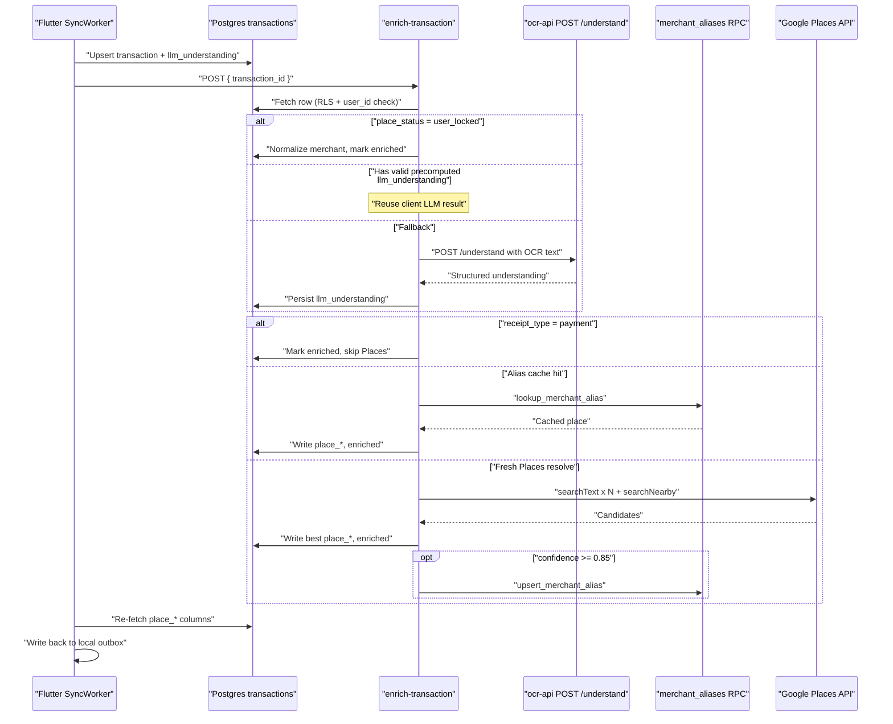

# How `enrich-transaction` works

Server-side step that turns a synced receipt into a **Google Place pin** (name, lat/lng, confidence). Runs as a Supabase Edge Function after the Flutter `SyncWorker` uploads a transaction — skipped while `pipeline_status == 'needs_review'`.

Canonical API notes live in [overview.md](overview.md); this file is a walkthrough of the control flow.

## Where it sits in the pipeline



After the invoke returns, `SyncWorker` re-fetches `place_*` / `merchant_normalized` / `pipeline_status` and mirrors them into the local Drift outbox so the UI shows the place name instead of raw OCR text.

## Inputs

| Source | Fields used |
|---|---|
| Request body | `{ transaction_id }` |
| Auth | User JWT → anon Supabase client (not service role); extra `row.user_id === user.id` check |
| Transaction row | `llm_understanding`, `raw_ocr_text` / `ocr_header_text`, `merchant_raw`, `share_location_lat/lng`, `place_status` |

Env: `GOOGLE_PLACES_API_KEY`, `OCR_SERVICE_URL` / `OCR_SERVICE_SECRET` (fallback LLM only), optional `CF_ACCESS_CLIENT_ID` / `CF_ACCESS_CLIENT_SECRET` in production.

## Step-by-step

### 1. Auth and load

POST only. Verify JWT, load the transaction by id, reject if missing or not owned by the caller.

### 2. Early exit: user-locked place

If `place_status == 'user_locked'` (user picked a place in the picker), skip Places entirely: normalize `merchant_raw` → `merchant_normalized`, set `pipeline_status = 'enriched'`, return `{ ok: true, skipped_places: true }`.

### 3. Receipt understanding (LLM)

**Primary path — precomputed:** Prefer `transactions.llm_understanding` already synced by the client (OCR + LLM ran together at capture). Re-validate with `parseReceiptUnderstanding()`. Skip if missing, has `_error`, or fails validation.

**Fallback:** Call `services/ocr-api` `POST /understand` with `raw_ocr_text` (else `ocr_header_text`). Persist the result (or `_error`) on the row. No usable OCR text or a failed LLM call → `pipeline_status = 'failed_enrichment'`.

Understanding shape (simplified):

```text
merchant_name, merchant_search_queries, address_text, location_clues,
vendor_category, google_place_types, line_items, confidence, receipt_type
```

`merchant_candidates` / `category_guess` are **not** read here anymore — superseded by the LLM fields.

### 4. Early exit: payment receipts

If `receipt_type == 'payment'` (e.g. Touch 'n Go, GrabPay), mark enriched and **skip Places** — not a physical venue.

### 5. Alias fast-path

When share GPS exists and merchant text is usable (`isUsableMerchantText` + LLM `confidence.merchant >= 0.6`):

1. Key = normalized LLM `merchant_name` + geohash (precision 7) of share location
2. `lookup_merchant_alias(...)`
3. On hit → write `place_*` from cache, `place_status = 'guess'`, `pipeline_status = 'enriched`, return — **no Google Places call**

Cache miss or RPC failure falls through (optimization, not required for correctness).

### 6. Google Places resolve

Needs `GOOGLE_PLACES_API_KEY`. Builds:

- Up to **3** text queries via `buildLlmTextQueries(understanding)`
- Nearby `includedTypes` via `resolveIncludedTypes(understanding)`

Concurrent calls (300 m radius when GPS present):

- `places:searchText` per query (`languageCode: ms`, `regionCode: MY`)
- One `places:searchNearby` (only if GPS)

No queries and no GPS → `failed_enrichment` (`no_search_signal`). All HTTP failures → `places_error`. Zero candidates → `no_places`.

### 7. Score and pick a winner

Merge candidates by place id. Score each with `scoreCandidate()` (Dice on best query text + distance), then `adjustScoreForTypeMatch()` (×0.6 if Places types share nothing with LLM `google_place_types`).

Weights depend on usable merchant text:

| | Usable merchant | Weak / missing merchant |
|---|---|---|
| Text weight | 0.6 | 0.15 |
| Distance weight | 0.4 | 0.85 |
| Confidence cap | 0.97 (or 0.9 without GPS) | 0.65 |

Write winner to `place_*`, `place_status = 'guess'`, `pipeline_status = 'enriched'`.

### 8. Alias write-back

If GPS + usable text + winner confidence ≥ `ALIAS_SAVE_CONFIDENCE_THRESHOLD` (0.85), best-effort `upsert_merchant_alias(...)` so the next scan of the same merchant nearby hits step 5.

## Outcomes

| `pipeline_status` | Meaning |
|---|---|
| `enriched` | Done (Places hit, alias hit, payment skip, or user-locked) |
| `failed_enrichment` | No OCR, LLM fail, no search signal, Places error/empty, missing API key |

Failures are silent in the product UI by design (“no anxiety UI”); check Edge Function logs / row status when debugging.

## Key files

| Path | Role |
|---|---|
| `supabase/functions/enrich-transaction/index.ts` | Handler |
| `supabase/functions/_shared/receipt_understanding.ts` | Parse / LLM fallback / query + type helpers |
| `supabase/functions/_shared/place_matching.ts` | Geohash, scoring, radius, alias thresholds |
| `lib/data/repositories/sync_worker_flutter.dart` | Invoke + local write-back |
| `services/ocr-api` `POST /understand` | Fallback LLM only |

## Related docs

- [overview.md](overview.md) — endpoint contract and shared helpers
- [../system/architecture.md](../system/architecture.md) — end-to-end capture → sync → enrich flow
- [../database/schema.md](../database/schema.md) — `llm_understanding`, `merchant_aliases`, RPCs
- [../system/decisions.md](../system/decisions.md) — why LLM moved client-synchronous; alias cache
- [`memory/bugs.md`](../memory/bugs.md) — past sync write-back / `category_confidence` gaps
