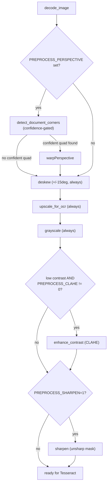
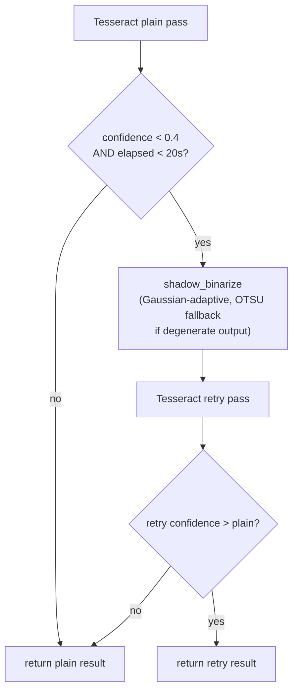

# OCR preprocessing pipeline upgrade

**Status:** Planned (not yet implemented)  
**Service:** `services/ocr-api`  
**Goal:** Improve receipt OCR accuracy toward CamScanner-like quality without degrading already-clean images.

Extend `services/ocr-api`'s existing `preprocessing.py` (not a rewrite) with a confidence-gated document detector feeding perspective correction, a low-contrast-gated CLAHE step, an opt-in unsharp-mask sharpen step, a smarter adaptive-threshold fallback, and an optional debug image dump — all env-flag controlled, all backward compatible with the `/ocr` response.

---

## Current pipeline (confirmed by reading the code + running the existing tests)

`services/ocr-api/ocr_api/preprocessing.py` today:

```
decode_image()
  -> [perspective_correct() if PREPROCESS_PERSPECTIVE set]   (rough 4-corner contour, no confidence gate)
  -> deskew()                                                 (always, +/-15 deg clamp)
  -> upscale_for_ocr()                                        (always, min width 2500px)
  -> grayscale                                                (always)
  -> returns 2D ndarray
```

`services/ocr-api/ocr_api/ocr_engine.py`'s `run_ocr_detailed()`:

- Runs Tesseract once ("plain" pass).
- If calibrated confidence < 0.4 **and** the plain pass took < `_RETRY_TIME_BUDGET_SECONDS` (20.0s), retries once against `shadow_binarize()` (Gaussian adaptive threshold, block size 51) and keeps whichever pass scored higher.
- The 20s budget guard exists because of a **documented production incident**: a 51s plain pass (9% confidence) followed by a 70s binarize retry that scored *worse* (6%) — 122s wasted. This is load-bearing; any change to the retry path must respect it.
- `enhance_contrast()` (CLAHE) and `binarize()` (OTSU) already exist in `preprocessing.py` but are **unused** in the default path — a documented, measured finding from the PaddleOCR→Tesseract migration ([`memory/experiments.md`](../../memory/experiments.md), [`docs/system/decisions.md`](../system/decisions.md)): CLAHE/pre-binarization degraded Tesseract results when applied unconditionally.

`services/ocr-api/ocr_api/main.py`'s `POST /ocr` calls `preprocess()` then `run_ocr_detailed()` then the LLM understanding step, in one request/response. **No PDF handling exists in this service** — PDFs are text-extracted client-side via `pdfrx` and never reach `ocr-api` ([`docs/system/architecture.md`](../system/architecture.md)). So "Image / PDF" at the top of the requested pipeline only applies to the image half here.

**Tests:** `tests/test_preprocessing.py` (7 tests), `tests/test_ocr_engine.py` (13 tests), `tests/test_main.py` (route-level). All 20 preprocessing/engine tests currently pass. `tests/conftest.py` provides one shared fixture: a synthetic 400×300 rotated (~8°) low-contrast receipt image.

---

## Decisions from clarifying questions

- **Adaptive threshold retry:** keep it a **single** Tesseract retry pass (no 3rd full OCR call). `shadow_binarize()` internally checks if its own Gaussian-adaptive output is degenerate (near all-white or all-black — a cheap `np.mean(binary == 255)` check, no Tesseract involved) and falls back to `binarize()` (OTSU) in that case. This preserves the existing `_RETRY_TIME_BUDGET_SECONDS` guard's intent.
- **Sharpening default:** `PREPROCESS_SHARPEN` defaults to **off** (opt-in via `=1`), consistent with every other flag in this pipeline (`PREPROCESS_PERSPECTIVE`, `PREPROCESS_ADAPTIVE_BINARIZE`) and the codebase's measured-before-default-on convention.

---

## Module structure decision

Keep the single flat `preprocessing.py` module — **not** the suggested `preprocessing/decoder.py, perspective.py, ...` package split. `main.py`, `ocr_engine.py` (lazy imports), and all existing tests import directly from `ocr_api.preprocessing`; splitting would touch every call site for no functional benefit and contradicts "minimal, clean changes." New functions are added to the same module, grouped and commented like the existing ones.

---

## Files to change

### [`services/ocr-api/ocr_api/preprocessing.py`](../../services/ocr-api/ocr_api/preprocessing.py) — the only production code file touched

1. **Document detection + improved perspective correction**
   - New `detect_document_corners(image) -> np.ndarray | None`: grayscale → `GaussianBlur` → `Canny` → `dilate` → `findContours` → for the top-5 contours by area, `approxPolyDP` to a 4-point polygon, reject if not convex, reject if contour area is outside `[_MIN_DOCUMENT_AREA_RATIO, _MAX_DOCUMENT_AREA_RATIO]` of total image area. Returns `_order_points()`-ordered corners or `None`.
   - `perspective_correct()` becomes a thin wrapper: call the detector, if `None` return the image unchanged, else `getPerspectiveTransform` + `warpPerspective`. Behavior when `PREPROCESS_PERSPECTIVE` is unset is unchanged.
   - New env-tunable constants: `_MIN_DOCUMENT_AREA_RATIO` (default 0.2), `_MAX_DOCUMENT_AREA_RATIO` (default 0.98).

2. **Sharpen stage** (new, opt-in)
   - New `sharpen(gray) -> np.ndarray`: unsharp mask — `GaussianBlur` then `cv2.addWeighted(gray, 1+amount, blurred, -amount, 0)`. Mild default amount (0.6) and sigma (1.0), both env-overridable.
   - Wired into `preprocess()` right after grayscale/CLAHE, gated by `PREPROCESS_SHARPEN` — default off.

3. **CLAHE, contrast-gated**
   - New `_is_low_contrast(gray) -> bool`: `gray.std() < _CLAHE_CONTRAST_STD_THRESHOLD`.
   - `preprocess()` calls `enhance_contrast()` only when `_is_low_contrast()` is true **and** `PREPROCESS_CLAHE` env var is not explicitly `"0"`.

4. **Smarter adaptive-threshold retry** (no `ocr_engine.py` signature changes)
   - `shadow_binarize()` keeps its exact signature. Internally: if Gaussian-adaptive output is degenerate (`mean(result == 255)` outside 0.02–0.98), fall back to `binarize()` (OTSU).

5. **Debug dump** (new, opt-in, default off)
   - New `_dump_debug_image(step, image)` — writes to `PREPROCESS_DEBUG_DIR` (default `services/ocr-api/.debug/`) when `PREPROCESS_DEBUG=1`.
   - Stages: `original`, `perspective`, `deskewed`, `upscaled`, `grayscale`, `clahe`, `sharpened`, `thresholded` (last one from `ocr_engine.run_ocr_detailed`'s retry branch).

6. Update `preprocess()` docstring with new stage order and all flags.

### New pipeline order inside `preprocess()`



### Retry path (`ocr_engine.run_ocr_detailed`)



### Tests

- Extend [`services/ocr-api/tests/conftest.py`](../../services/ocr-api/tests/conftest.py) with fixtures: angled-on-background, low-light, low-res, clean receipt images.
- Extend [`services/ocr-api/tests/test_preprocessing.py`](../../services/ocr-api/tests/test_preprocessing.py) for all new functions and confidence gates.
- Add one route-level test in [`services/ocr-api/tests/test_main.py`](../../services/ocr-api/tests/test_main.py) confirming `/ocr` response schema unchanged with new flags set.

### Other files

- [`.gitignore`](../../.gitignore) — add `services/ocr-api/.debug/`
- [`docs/api/overview.md`](../api/overview.md) — update `/ocr` pipeline description
- [`docs/system/decisions.md`](../system/decisions.md) — new dated ADR entry
- [`memory/experiments.md`](../../memory/experiments.md) — note conditional CLAHE re-enable

---

## Environment variables (new/changed)

| Variable | Default | Notes |
|---|---|---|
| `PREPROCESS_PERSPECTIVE=1` | off | Now requires confidence gate before warping |
| `PREPROCESS_CLAHE` | on (heuristic-gated) | `=0` fully disables |
| `PREPROCESS_CLAHE_CONTRAST_THRESHOLD` | ~45.0 std-dev | Tuning knob |
| `PREPROCESS_SHARPEN=1` | off | Opt-in unsharp mask |
| `PREPROCESS_SHARPEN_AMOUNT` / `PREPROCESS_SHARPEN_SIGMA` | 0.6 / 1.0 | Tuning knobs |
| `PREPROCESS_ADAPTIVE_BINARIZE=1` | off | Unchanged; function is smarter internally |
| `PREPROCESS_DEBUG=1` | off | Dumps to `services/ocr-api/.debug/` |
| `PREPROCESS_DEBUG_DIR` | `.debug/` | Override dump directory |
| `MIN_OCR_WIDTH` | 2500 | Unchanged |

---

## Expected improvement and tradeoffs

- Perspective correction should trigger more precisely (confidence-gated) instead of only firing on a lucky clean 4-point contour.
- CLAHE helps genuinely low-contrast/low-light captures while leaving clean images untouched.
- Sharpening is opt-in — no behavior change until explicitly enabled and measured.
- Adaptive-threshold retry stays a single extra Tesseract pass — no risk of reintroducing the documented 122s incident.
- New CPU cost: Canny/contour detection only runs when `PREPROCESS_PERSPECTIVE=1`; contrast and degenerate-threshold checks are cheap numpy ops.
- All new behavior is env-gated or heuristic-gated by default — deployed k8s behavior does not change on redeploy unless envs are explicitly set.

---

## Implementation checklist

- [ ] Add `detect_document_corners()` with area/convexity confidence gate; rewrite `perspective_correct()`
- [ ] Add `_is_low_contrast()` heuristic and wire contrast-gated CLAHE into `preprocess()`
- [ ] Add `sharpen()` unsharp-mask function, wire behind opt-in `PREPROCESS_SHARPEN`
- [ ] Make `shadow_binarize()` fall back to OTSU internally when output is degenerate
- [ ] Add opt-in `PREPROCESS_DEBUG` image dump helper, call at each pipeline stage
- [ ] Add `services/ocr-api/.debug/` to `.gitignore`
- [ ] Add conftest fixtures: angled-on-background, low-light, low-res, clean receipt images
- [ ] Extend `test_preprocessing.py` covering all new functions and confidence gates
- [ ] Add `test_main.py` regression test confirming `/ocr` response schema unchanged
- [ ] Run full ocr-api pytest suite and confirm no regressions
- [ ] Update `docs/api/overview.md`, add `docs/system/decisions.md` entry, note in `memory/experiments.md`
