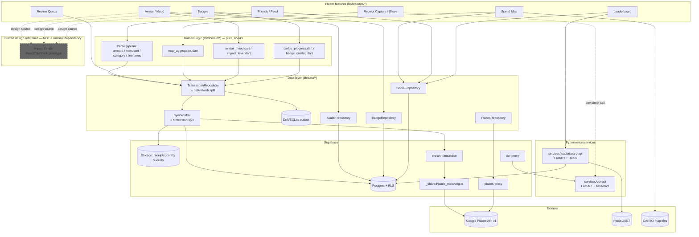
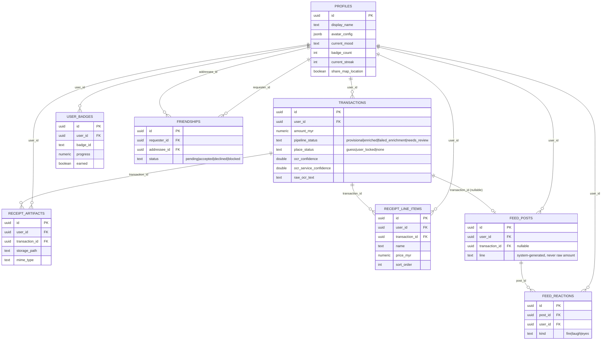
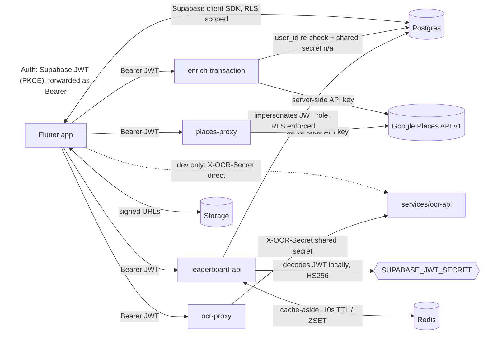

# Dependency Graph

## How to use this graph

Before modifying code:
1. Identify the feature being changed (see "Feature dependency mapping" below).
2. Check its dependencies — what it relies on, and what relies on it.
3. Review "High Impact Files" before touching anything on that list; a change there ripples across features you may not be looking at.
4. Check "Isolated Components" if you want a low-risk file to practice a change on, or to confirm a file really is self-contained before assuming so.
5. **Update this graph** after any architecturally significant change (new table, new service, a file moving from "isolated" to "shared", a new cross-feature dependency).

This file is complementary to `memory/feature_graph.md` (feature-to-file mapping) and `docs/database.md`/`docs/api.md` (full schema/endpoint detail) — this file adds import-level precision, risk ratings, and visual graphs those don't have.

---

## 1. System architecture overview



---

## 2. Feature dependency mapping

### Receipt Capture / OCR Ingest

**Purpose**: capture a receipt (share sheet or in-app), OCR it, extract structured data, save instantly offline, sync in the background.

**Entry points**:
- Screens: `lib/features/share/receipt_capture_menu.dart`, `share_hint_screen.dart`
- Controllers/flows: `lib/features/share/receipt_capture_flow.dart`, `share_intent_listener.dart`
- Services: `lib/features/share/receipt_ingest_service.dart` (+`_io`/`_web`), `ocr_pipeline.dart` (+`_io`/`_web`)

**Depends on**:
- OCR API (`services/ocr-api`, via `ocr-proxy` Edge Function in prod, direct in dev)
- Parse pipeline (domain logic)
- `TransactionRepository` / Drift outbox
- `SyncWorker` → Supabase Storage + `enrich-transaction`

**Files**:
- `lib/features/share/share_intent_listener.dart`, `receipt_capture_flow.dart`, `receipt_capture_menu.dart`
- `lib/features/share/receipt_file_store.dart` (+`_io`/`_web`), `receipt_ingest_service.dart` (+`_io`/`_web`), `receipt_ingest_draft.dart`
- `lib/features/share/ocr_pipeline.dart` (+`_io`/`_web`), `ocr_api_client.dart`, `receipt_parse_file.dart`, `receipt_parse_pipeline.dart`
- `lib/data/repositories/transaction_repository.dart` (+`_native`/`_web`), `ingest_receipt_request.dart`, `sync_worker.dart` (+`_flutter`/`_stub`)

**Data flow**:
```
Shared image/PDF (OS share sheet or in-app picker)
  ↓
receipt_file_store (persist bytes locally)
  ↓
ocr_pipeline (self-hosted Tesseract OCR, direct or via ocr-proxy)
  ↓
receipt_parse_pipeline (line-items → amount → merchant → category, + combinedConfidence)
  ↓
ReceiptIngestDraft → ShareSaveSheet (user confirms/edits)
  ↓
TransactionRepository.ingestReceipt() → Drift outbox (transaction + artifact + line items)
  ↓ (fire-and-forget)
SyncWorker → Supabase Storage + transactions/receipt_artifacts/receipt_line_items → enrich-transaction Edge Function
```

---

### Review Queue

**Purpose**: catch low-confidence/failed OCR parses instead of silently dropping or mis-saving them; one-tap confirm re-enters the normal pipeline.

**Entry points**: `lib/features/review/receipt_review_screen.dart`

**Depends on**: Receipt Capture (produces the `needs_review` signal), `TransactionRepository.confirmReview()`, `SyncWorker` (must skip enrichment while `needs_review`)

**Files**: `lib/features/review/receipt_review_screen.dart`, `lib/data/repositories/transaction_repository_native.dart` / `_web.dart`, `lib/data/repositories/sync_worker_flutter.dart`, `supabase/migrations/20260705000000_receipt_review_and_raw_ocr.sql`

**Data flow**:
```
combinedConfidence below threshold OR parse failure
  ↓
pipeline_status = 'needs_review' (enrichment deferred)
  ↓
ReceiptReviewScreen (user confirms amount/details)
  ↓
confirmReview() → pipeline_status = 'provisional' → normal sync/enrich resumes
```

---

### Spend Map

**Purpose**: own spend bubbles/heat map plus friends' snap-style location pins (place + time only, never amount).

**Entry points**: `lib/features/map/spend_map_screen.dart`

**Depends on**: `map_aggregates.dart` (own data clustering), `SocialRepository` (`get_friend_map_pins()` RPC), `flutter_map` + CARTO tiles

**Files**: `lib/features/map/spend_map_screen.dart`, `lib/features/map/widgets/*.dart`, `lib/widgets/map_filter_chips.dart`, `lib/domain/logic/map_aggregates.dart`, `lib/core/utils/place_key.dart`, `lib/data/repositories/social_repository.dart`, `supabase/migrations/20260706000000_friend_map_pins.sql`

**Data flow**:
```
TransactionView stream → mapClusters/heatCells (own bubbles)
SocialRepository.getFriendMapPins() → get_friend_map_pins() RPC (friend pins)
  ↓
SpendMapScreen (flutter_map + CARTO tiles, own + friend layers)
```

---

### Avatar / Mood

**Purpose**: derive and display an avatar mood from today's spend behavior; user-customizable avatar (color/eyes/hat).

**Entry points**: `lib/features/avatar/avatar_customizer_screen.dart`, `lib/features/summary/summary_screen.dart`

**Depends on**: Receipt Capture (today's transactions drive mood), `AvatarRepository` (persistence + cross-device sync), Impact Drops prototype (original design/behavior source — historical reference only)

**Files**: `lib/domain/logic/avatar_mood.dart`, `impact_level.dart`, `lib/domain/models/avatar_config.dart`, `lib/widgets/blob_avatar.dart`, `pixel_avatar.dart`, `lib/data/repositories/avatar_repository.dart`, `lib/domain/logic/diorama_theme.dart`/`diorama_props.dart`, `lib/widgets/diorama_scene.dart`/`themed_scene_background.dart`

**Data flow**:
```
Today's TransactionView list
  ↓
avatar_mood.deriveAvatarMood() (calm/active/spiky/balanced)
  ↓
AvatarRepository.syncCurrentMood() (denormalize to profiles.current_mood)
  ↓
BlobAvatar / PixelAvatar widgets + ThemedSceneBackground (category-themed scene)
```

---

### Badges

**Purpose**: gamified progress tracking against a bundled badge catalog.

**Entry points**: `lib/features/badges/badges_screen.dart`

**Depends on**: Receipt Capture (progress computed from transaction history), bundled catalog (`assets/config/badges-v1.json`, not a DB table), `BadgeRepository`

**Files**: `lib/domain/logic/badge_catalog.dart`, `badge_progress.dart`, `lib/data/repositories/badge_repository.dart`, `lib/widgets/badge_hex.dart`, `badge_detail_dialog.dart`, `top_badges_grid.dart`, `lib/features/badges/badges_screen.dart`, `supabase/migrations/20260626000001_badges.sql`

**Data flow**:
```
TransactionView history → badge_progress (per-badge pure functions)
  ↓
BadgeRepository (persist progress/earned to user_badges)
  ↓
AvatarRepository.syncBadgeCount() (denormalize to profiles.badge_count, feeds leaderboard)
  ↓
BadgesScreen / BadgeHex / TopBadgesGrid
```

---

### Friends / Feed

**Purpose**: add/accept/decline friends; auto-generated activity feed (never raw amounts) with emoji reactions.

**Entry points**: `lib/features/friends/friends_screen.dart`, `lib/features/feed/feed_screen.dart`

**Depends on**: `friendships`/`feed_posts`/`feed_reactions` tables, Receipt Capture (best-effort feed post on save), Impact Drops prototype (`feed.tsx` design source)

**Files**: `lib/domain/logic/feed_line_generator.dart`, `lib/widgets/reaction_chip.dart`, `lib/data/repositories/social_repository.dart`, `supabase/migrations/20260626000002_social.sql`

**Data flow**:
```
Receipt saved
  ↓
feed_line_generator (impact tier + category noun + place, never amount)
  ↓
SocialRepository.createFeedPost() → feed_posts table
  ↓
get_friend_feed() RPC → FeedScreen (+ reaction counts from feed_reactions)
```

---

### Leaderboard (Friends + Global)

**Purpose**: rank self vs. friends (live Postgres RPC) and vs. everyone (cached Redis ZSET).

**Entry points**: `lib/features/leaderboard/leaderboard_screen.dart`

**Depends on**: `profiles.current_streak`/`badge_count` (denormalized), `get_friend_leaderboard()` RPC, `services/leaderboard-api` + Redis (global tier — no Postgres fallback)

**Files**: `lib/data/repositories/social_repository.dart`, `lib/domain/logic/leaderboard_label.dart`, `supabase/migrations/20260626000003_leaderboard.sql`, `20260630000000_leaderboard_api.sql`, `20260630100000_global_leaderboard.sql`, `services/leaderboard-api/leaderboard_api/*.py`, `docker-compose.yml`

**Data flow**:
```
Friends tier: SocialRepository → get_friend_leaderboard() RPC (direct, or via leaderboard-api impersonating JWT) → Postgres (RLS-scoped)
Global tier: POST /leaderboard/score (per home-screen open) → Redis ZSET upsert
             GET /leaderboard/global → ZREVRANGE top 100 → hydrate via get_leaderboard_profiles_by_ids()
```

---

### Batch/CLI Receipt Processing (dev tooling)

**Purpose**: run the same OCR+parse pipeline against a folder of receipt images for fixture/regression testing, no Supabase needed.

**Entry points**: `bin/process_receipts.dart` (CLI), `scripts/process_receipts.ps1` (wrapper)

**Depends on**: OCR API (direct, never via `ocr-proxy`), parse pipeline (same code as the app), `receipt_batch_e2e.dart` for optional in-memory outbox verification

**Files**: `bin/process_receipts.dart`, `scripts/process_receipts.ps1`, `lib/features/share/receipt_batch_e2e.dart`, `lib/domain/logic/category_matcher_io.dart`

**Data flow**:
```
receipts/*.png|jpeg
  ↓
runOcrApi() (direct HTTP to services/ocr-api)
  ↓
parseReceiptOcrText() (same pipeline as the app)
  ↓ (--e2e flag only)
persistParsedReceiptE2e() (in-memory outbox round-trip check)
  ↓
_results.json
```

---

## 3. File-level dependency map

Format: Responsibility / Imports / Used by / Risk / Reason. "Used by" counts are direct-import edges confirmed by grep, not conceptual dependents.

### `lib/domain/models/transaction_view.dart`
**Responsibility**: unified UI-facing receipt row; merges outbox fields with derived getters (`effectiveCategory`, `effectiveImpactLevel`, `includeInCharts`, `needsReview`).
**Imports**: `lib/domain/logic/impact_level.dart`, `receipt_line_item.dart`.
**Used by** (24 files): nearly every feature screen (`tx_detail`, `map`, `review`, `home`, `avatar`, `badges`, `summary`, `receipt_saved`) plus several `widgets/*` and `domain/logic/*` files (`map_aggregates.dart`, `feed_line_generator.dart`, `badge_progress.dart`, `avatar_mood.dart`, `awareness.dart`) and both repository variants.
**Risk**: High.
**Reason**: single highest blast-radius file in the repo — any shape change here needs a sweep across nearly every feature.

### `lib/core/config/env.dart`
**Responsibility**: central config reader (dart-define → `.env` priority), exposes Supabase/OCR/leaderboard URLs and `skipAuth`.
**Imports**: `flutter/foundation.dart`, `flutter_dotenv` (no project-local imports).
**Used by** (12 files): `main.dart`, `app_router.dart`, `ocr_pipeline_io.dart`, `settings_screen.dart`, `home_screen.dart`, `leaderboard_screen.dart`, `adaptive_sync_banner.dart`, `sync_worker_flutter.dart`, `social_repository.dart`, `places_repository.dart`, `avatar_repository.dart`, `badge_repository.dart`.
**Risk**: High.
**Reason**: flat, wide blast radius across screens, repositories, and the sync worker; a signature/behavior change ripples everywhere at once even though it has zero internal dependency risk itself.

### `lib/data/repositories/transaction_repository.dart` (+ `_native.dart`/`_web.dart`)
**Responsibility**: conditional-export ingest/read API for the outbox (`ingestReceipt`, `watchAll`, `watchNeedsReview`, `confirmReview`, `retryStuckSync`).
**Imports**: `_native.dart` imports `drift`, `uuid`, `avatar_mood.dart`, `receipt_line_item.dart`, `transaction_view.dart`, `app_database.dart`, `demo_transactions.dart`, `ingest_receipt_request.dart`, `sync_worker.dart`; `_web.dart` drops `app_database.dart`/`sync_worker.dart` (pure in-memory).
**Used by**: `receipt_batch_e2e.dart`, `app_services_web.dart`, `app_services_io.dart` (all via the conditional-export file).
**Risk**: High.
**Reason**: the single ingest/read choke point for every receipt in the app; native variant notably depends on domain logic (`avatar_mood.dart`) — a repository→domain-logic edge, not the more typical reverse.

### `lib/data/repositories/sync_worker.dart` (+ `_flutter.dart`/`_stub.dart`)
**Responsibility**: uploads artifact + rows to Supabase, invokes `enrich-transaction`, retries up to 5x before marking `stuck`.
**Imports**: `_flutter.dart` imports `dart:io`, `drift`, `supabase_flutter`, `env.dart`, `app_database.dart`; `_stub.dart` imports only `app_database.dart` (true no-op body).
**Used by**: `transaction_repository_native.dart` only (via conditional export).
**Risk**: High.
**Reason**: sole sync boundary between local outbox and cloud — a bug here silently produces stuck/duplicate/lost syncs across every capture.

### `lib/data/local/app_database.dart` + `tables.dart`
**Responsibility**: Drift schema definition (`schemaVersion = 5`, `onUpgrade` migrations) and the SQLite connection.
**Imports**: `app_database.dart` imports `drift`, `drift/native`, `app_database_connection_{stub,flutter}.dart`, `tables.dart`. `tables.dart` imports only `drift`.
**Used by**: `app_database.dart` used by `receipt_batch_e2e.dart`, `transaction_repository_native.dart`, `sync_worker_stub.dart`, `sync_worker_flutter.dart`, `app_services_io.dart`. `tables.dart` has **zero** direct importers — pulled in structurally via Drift's `@DriftDatabase(tables: [...])` annotation, not `import`.
**Risk**: High (schema) / Low (tables.dart in isolation — see Isolated Components).
**Reason**: any column/table change needs a `schemaVersion` bump + `onUpgrade` migration, and often a matching Postgres migration if the field syncs to the cloud.

### `lib/core/routing/app_router.dart`
**Responsibility**: `go_router` setup — auth/onboarding redirect logic, 4-tab `StatefulShellRoute`, ~14 modal/detail routes.
**Imports**: `go_router`, `supabase_flutter`, `app_prefs.dart`, `env.dart`, `auth_refresh.dart`, and nearly every top-level screen under `features/*`, plus `main_shell.dart`.
**Used by**: `main.dart` only.
**Risk**: High.
**Reason**: low direct-importer count (1) but the widest **outbound** fan-out in the app (imports almost every screen) — breaking navigation here breaks access to nearly everything, even though nothing "depends on" it in the traditional sense.

### `lib/features/share/receipt_parse_pipeline.dart`
**Responsibility**: orchestrates line-item extraction → amount parsing → merchant extraction → category guess, producing `combinedConfidence`.
**Imports**: `category_matcher.dart`, `impact_level.dart`, `merchant_extractor.dart`, `receipt_line_item_extractor.dart`, `rm_amount_parser.dart`, `receipt_line_item.dart`.
**Used by**: `receipt_parse_file.dart`, `receipt_ingest_service.dart`, `receipt_batch_e2e.dart`.
**Risk**: High.
**Reason**: sole hub for the parse pipeline — a fixed set of only 3 importers, but those 3 are exactly the app's ingest path and the batch CLI's regression harness; a regression here surfaces everywhere receipts get parsed.

### `lib/domain/logic/rm_amount_parser.dart`
**Responsibility**: scores/picks the paid total from OCR text (keyword/position/cluster/cross-check heuristics).
**Imports**: none project-local.
**Used by**: `receipt_parse_pipeline.dart`, `receipt_line_item_extractor.dart` (via `show`, for shared constants — also re-exported from there), `share_save_sheet.dart`.
**Risk**: Medium.
**Reason**: narrow, well-tested surface (dedicated test file); risk is concentrated in heuristic regressions, not blast radius.

### `lib/domain/logic/merchant_extractor.dart`
**Responsibility**: picks the merchant name line from OCR text.
**Imports**: `category_matcher.dart`.
**Used by**: `receipt_parse_pipeline.dart`, `receipt_line_item_extractor.dart` (via `show`, boilerplate-detection helpers).
**Risk**: Medium.
**Reason**: shared boilerplate-stripping helpers are reused by the line-item extractor — a signature change ripples to two parse stages.

### `lib/domain/logic/category_matcher.dart` (+ `_bundled.dart`/`_io.dart` loaders)
**Responsibility**: keyword-substring category matching + confidence scoring.
**Imports**: `dart:convert` only.
**Used by**: `receipt_parse_pipeline.dart`, `merchant_extractor.dart`, `receipt_parse_file.dart`, `receipt_ingest_service.dart`, `share_save_sheet.dart`, `receipt_capture_flow.dart`, `transaction_detail_screen.dart`, plus both loader variants.
**Risk**: Medium-High.
**Reason**: 8 direct importers across the capture flow and detail screen; the `CategoryConfig` shape is a shared contract for all of them.

### `lib/domain/logic/receipt_line_item_extractor.dart`
**Responsibility**: regex-cascade extraction of item/price/qty rows, reconciled against the picked total.
**Imports**: `receipt_line_item.dart`, `merchant_extractor.dart` (`show`), `rm_amount_parser.dart` (`show`, and re-`export`s two constants).
**Used by**: `receipt_parse_pipeline.dart` only.
**Risk**: Medium.
**Reason**: single importer, but re-exports symbols from `rm_amount_parser.dart` — a hidden coupling: code importing this file can get `rm_amount_parser` constants transitively without importing it directly.

### `lib/core/utils/place_key.dart`
**Responsibility**: geohash/effective-place-key logic for aggregating map bubbles.
**Imports**: none project-local.
**Used by**: `map_aggregates.dart` only.
**Risk**: Low.
**Reason**: single importer despite conceptually underpinning map/place features — see Isolated Components. Note: mirrors related logic implemented independently in `supabase/functions/_shared/place_matching.ts` (different language, no code dependency, but a parity risk if one is tuned without the other).

### `lib/data/repositories/avatar_repository.dart`
**Responsibility**: avatar config persistence + denormalization pushes (`syncCurrentMood`, `syncCurrentStreak`, `syncBadgeCount`) onto `profiles`.
**Imports**: `supabase_flutter`, `env.dart`, `avatar_config.dart`.
**Used by**: `spend_map_screen.dart`, `home_screen.dart`, `top_badges_grid.dart`, `avatar_customizer_screen.dart`, `summary_screen.dart`.
**Risk**: Medium.
**Reason**: the denormalization writes here are what keep friend-facing queries (leaderboard, feed) RLS-friendly — a bug here silently breaks cross-user visibility of streak/badge/mood, not just the avatar screen.

### `lib/data/repositories/badge_repository.dart`
**Responsibility**: reads/writes `user_badges`.
**Imports**: `supabase_flutter`, `uuid`, `env.dart`.
**Used by**: `badges_screen.dart` only.
**Risk**: Low.
**Reason**: single importer, no domain-logic dependency — see Isolated Components.

### `lib/data/repositories/social_repository.dart`
**Responsibility**: friends, feed, friend map pins, friend/global leaderboard fetch, `share_map_location` toggle.
**Imports**: `dart:convert`, `http`, `supabase_flutter`, `uuid`, `env.dart`, `feed_line_generator.dart` (domain logic), `transaction_view.dart` (domain model).
**Used by**: `spend_map_screen.dart`, `settings_screen.dart`, `friend_pin_sheet.dart`, `friend_map_marker.dart`, `receipt_capture_flow.dart`, `home_screen.dart`, `leaderboard_screen.dart`, `friends_screen.dart`, `feed_screen.dart`.
**Risk**: Medium-High.
**Reason**: widest importer count of the four social/gamification repositories, and the only one that breaks the "thin Supabase wrapper" pattern by depending on domain logic/models directly.

### `lib/data/repositories/places_repository.dart`
**Responsibility**: thin wrapper over the `places-proxy` Edge Function.
**Imports**: `supabase_flutter`, `env.dart`.
**Used by**: `transaction_detail_screen.dart`, `spend_map_screen.dart`, `places_search_screen.dart`.
**Risk**: Low-Medium.

### `lib/widgets/main_shell.dart`
**Responsibility**: app shell — bottom nav (4 tabs) + centered capture FAB, platform-adaptive chrome.
**Imports**: `go_router`, `platform_feedback.dart`, `platform_utils.dart`, `app_theme.dart`, `receipt_capture_flow.dart`.
**Used by**: `app_router.dart` only.
**Risk**: Medium.
**Reason**: a widget reaching directly into `features/share/receipt_capture_flow.dart` rather than through routing — tight coupling worth knowing about if the capture flow's API changes.

### `supabase/functions/_shared/place_matching.ts`
**Responsibility**: Dice-coefficient text matching, haversine distance, distance-decay scoring, category→place-type mapping — the Places-candidate scoring logic.
**Imports**: none (pure exported helpers/constants).
**Used by**: `enrich-transaction/index.ts` **only** — confirmed `places-proxy/index.ts` does **not** import it, despite both calling Google Places.
**Risk**: High.
**Reason**: sole source of production place-matching accuracy for every enriched transaction; a scoring regression here silently degrades place suggestions app-wide with no user-facing error (by design).

### `supabase/functions/enrich-transaction/index.ts`
**Responsibility**: resolves a Google Place candidate for a transaction and writes back `merchant_normalized`/`place_*`/`pipeline_status`.
**Imports**: `@supabase/supabase-js`, `_shared/place_matching.ts` (all its exports).
**Used by**: n/a (edge function entry point, invoked over HTTP by `sync_worker_flutter.dart`).
**Risk**: High.
**Reason**: the only write path for post-capture enrichment; also the only edge function coupled to the shared matching module.

### `supabase/functions/ocr-proxy/index.ts` / `places-proxy/index.ts`
**Responsibility**: minimal auth-checked pass-through proxies (OCR service / Google Places `searchText`).
**Imports**: `@supabase/supabase-js` only, each — no shared-module coupling.
**Risk**: Low-Medium.
**Reason**: narrow, stateless proxies; lower risk than `enrich-transaction` precisely because they don't touch the DB or the shared scoring module.

### `services/ocr-api/ocr_api/main.py`
**Responsibility**: FastAPI hub — `/health`, `/ocr` routes, ties together auth/models/engine/preprocessing.
**Imports**: `ocr_api.auth`, `ocr_api.models`, `ocr_api.ocr_engine`, `ocr_api.preprocessing`.
**Used by**: `__main__.py` (as a uvicorn target string), test suite.
**Risk**: Medium.
**Reason**: clean one-directional star topology — `auth.py`/`ocr_engine.py`/`preprocessing.py`/`models.py` never import each other, so `main.py` is the only real integration point and the only place a wiring mistake could occur.

### `services/leaderboard-api/leaderboard_api/main.py`
**Responsibility**: FastAPI hub — `/health`, `/friends-leaderboard`, `/leaderboard/global`, `/leaderboard/score`.
**Imports**: `leaderboard_api.auth`, `leaderboard_api.cache`, `leaderboard_api.db`, `leaderboard_api.global_service`, `leaderboard_api.models`.
**Used by**: n/a (entry point).
**Risk**: Medium.

### `services/leaderboard-api/leaderboard_api/global_service.py`
**Responsibility**: orchestration layer bridging Redis (`cache.py`) and Postgres (`db.py`) for the global leaderboard — `upsert_user_score`, `fetch_top_global`, `rebuild_from_postgres`, `build_global_entries`.
**Imports**: `leaderboard_api.cache.get_redis`, `leaderboard_api.db.{fetch_all_leaderboard_scores, fetch_profiles_by_ids_as_user}`, `leaderboard_api.global_leaderboard.{GLOBAL_ZSET_KEY, leaderboard_score}`.
**Used by**: `main.py` only.
**Risk**: Medium-High.
**Reason**: the one secondary hub in an otherwise flat two-service backend — a bug here can silently desync Redis ranks from Postgres truth (cold-start rebuild is best-effort/swallowed on failure, see `memory/bugs.md`).

### `supabase/migrations/*.sql` (schema, as a class)
**Responsibility**: cumulative Postgres schema — see `docs/database.md` for full detail.
**Risk**: High (as a category).
**Reason**: `transactions.pipeline_status`'s check constraint has already been redefined once (auto-generated constraint name required an explicit `drop constraint if exists` — a documented footgun, see `20260705000000_receipt_review_and_raw_ocr.sql`); `profiles` RLS has already been deliberately widened once (`profiles_select_accepted_friend`). Both are exactly the kind of change that's easy to get subtly wrong (forgetting to drop an old constraint, over-widening a policy) and hard to notice until a specific cross-user scenario is tested.

---

## 4. Change impact analysis

### High Impact Files (top 10 — see section 8 for the same list with reasons)

1. `lib/domain/models/transaction_view.dart`
2. `lib/core/config/env.dart`
3. `lib/data/repositories/transaction_repository.dart` (+ `_native`/`_web`)
4. `lib/data/repositories/sync_worker.dart` (+ `_flutter`/`_stub`)
5. `lib/data/local/app_database.dart` + `tables.dart` (schema)
6. `lib/core/routing/app_router.dart`
7. `lib/features/share/receipt_parse_pipeline.dart`
8. `supabase/functions/_shared/place_matching.ts`
9. `supabase/migrations/*.sql` (cumulative `transactions`/`profiles` schema)
10. `services/leaderboard-api/leaderboard_api/global_service.py`

### Isolated Components (confirmed safe-to-modify-in-place candidates)

- **`lib/data/local/tables.dart`** — zero direct importers by path; wired in only through Drift's table-list annotation in `app_database.dart`.
- **`lib/core/utils/place_key.dart`** — exactly one importer (`map_aggregates.dart`).
- **`lib/data/repositories/badge_repository.dart`** — exactly one importer (`badges_screen.dart`), no domain-logic coupling.
- **The four social/gamification repositories as a group** (`avatar_repository.dart`, `badge_repository.dart`, `social_repository.dart`, `places_repository.dart`) — confirmed to never import each other; changing one's internals doesn't risk breaking a sibling.
- **`supabase/functions/ocr-proxy/index.ts`** and **`places-proxy/index.ts`** — no shared-module coupling, no DB writes; the lowest-risk edge functions.
- **`Impact Drops/` (entire directory)** — not imported/built/deployed by anything in the product; safe to ignore or delete without runtime impact (though it's a historical design reference — see `docs/architecture.md` before removing it).
- **`services/ocr-api/ocr_api/{auth,ocr_engine,preprocessing,models}.py`** — none of these four import each other; each can be modified independently of its siblings (only `main.py` ties them together).

### Shared Dependencies

- **`lib/domain/models/transaction_view.dart`** — the universal receipt model; see High Impact.
- **`lib/core/config/env.dart`** — the universal config reader; see High Impact.
- **`lib/domain/logic/category_matcher.dart`** — shared category-matching contract used by 8+ files across capture, detail, and both loader variants.
- **`lib/domain/logic/avatar_mood.dart`** — used by both `transaction_repository_native.dart` (data layer) and multiple UI screens; a rare domain-logic file consumed by the data layer itself.
- **`lib/domain/logic/impact_level.dart`** — threshold logic feeding `transaction_view.dart`'s `effectiveImpactLevel` and the avatar mood derivation.
- **`supabase/functions/_shared/place_matching.ts`** exports — the only cross-function shared module in the edge-function layer (used by `enrich-transaction` alone today, but written as a shared module in anticipation of reuse).
- **Drift `tables.dart` + `app_database.dart` schema** — the base class every outbox-touching repository and the sync worker builds on.

---

## 5. Database relationship graph



**Key constraints worth knowing before altering schema**:
- `transactions_pipeline_status_check` was already redefined once to add `needs_review` — Postgres auto-names inline CHECK constraints `<table>_<column>_check`, so a future value addition needs `drop constraint if exists ... ; add constraint ...`, not a bare `alter`.
- `friendships` update RLS is asymmetric by design: only the addressee can accept/decline; either party can block. Don't "simplify" this to a symmetric policy — it exists specifically to stop a requester from self-accepting their own request.
- `feed_reactions` has **insert-only** RLS (no select policy at all) — reads only ever happen aggregated inside `get_friend_feed()`. A direct client `select` against this table will return nothing even though a table grant exists.
- `receipt_artifacts` and `receipt_line_items` have no update policy — both are immutable-by-design.
- `profiles_select_accepted_friend` (added later) is additive to the original "own row only" policy — any accepted friend can read a full profile row; see `docs/decisions.md` for why.

---

## 6. API dependency graph



**Auth requirements summary**:

| Caller → Callee | Auth mechanism |
|---|---|
| Flutter → any Edge Function | `Authorization: Bearer <supabase JWT>`; function calls `auth.getUser()`, 401 if invalid |
| Edge Function → Postgres | anon key + forwarded JWT (RLS-scoped), not service role |
| `ocr-proxy` → `services/ocr-api` | `X-OCR-Secret` shared secret (`secrets.compare_digest`) — service is never called by end users directly |
| Flutter (dev only) → `services/ocr-api` | same shared secret, bundled only via dart-define/`.env`, never in release builds |
| Flutter → `services/leaderboard-api` | `Authorization: Bearer <supabase JWT>`, decoded **locally** by the service (HS256, `SUPABASE_JWT_SECRET`) — no round-trip to Supabase |
| `leaderboard-api` → Postgres | `asyncpg`, sets `role authenticated` + `request.jwt.claim.sub` per-transaction — impersonates the caller, RLS applies |
| `leaderboard-api` → Redis | none (internal network / docker-compose only) |
| Edge Functions → Google Places | server-side `GOOGLE_PLACES_API_KEY`, never shipped to the client |

**Request/response dependency notes**:
- `enrich-transaction` fans out to Google Places `searchText` **and** `searchNearby` concurrently, merges by place id, and scores via `_shared/place_matching.ts` before writing back — see section 3 for why this file is high-risk.
- `places-proxy`'s response is a raw Google Places pass-through; the client is responsible for calling back into the transaction update after the user picks a candidate (`place_status='user_locked'`).
- `leaderboard-api`'s global endpoint never touches Postgres for ranking (Redis ZSET only) — only for hydrating display metadata of the already-ranked top 100 user ids.

---

## 7. Top 10 highest-risk files (summary)

| # | File | Why |
|---|---|---|
| 1 | `lib/domain/models/transaction_view.dart` | 24 importers — highest blast radius in the repo |
| 2 | `lib/core/config/env.dart` | 12 importers, flat fan-out across screens/repos/sync worker |
| 3 | `lib/data/repositories/transaction_repository.dart` (+native/web) | sole ingest/read API for every receipt |
| 4 | `lib/data/repositories/sync_worker.dart` (+flutter/stub) | sole local↔cloud sync boundary |
| 5 | `lib/data/local/app_database.dart` + `tables.dart` | schema; needs versioned migrations, cross-checked against Postgres |
| 6 | `lib/core/routing/app_router.dart` | imports nearly every screen; breaks navigation app-wide if wrong |
| 7 | `lib/features/share/receipt_parse_pipeline.dart` | sole parse-pipeline hub feeding ingest + batch CLI |
| 8 | `supabase/functions/_shared/place_matching.ts` | sole production place-matching scoring logic |
| 9 | `supabase/migrations/*.sql` (schema class) | constraint-redefinition footguns + a real precedent of RLS widening |
| 10 | `services/leaderboard-api/leaderboard_api/global_service.py` | secondary hub bridging Redis + Postgres for the global leaderboard |
