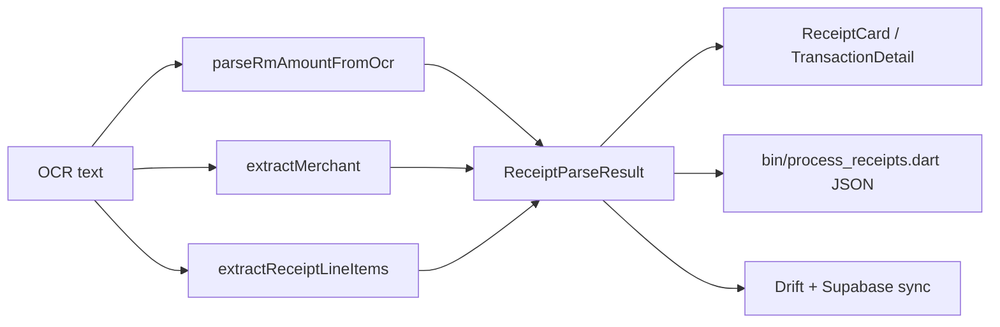
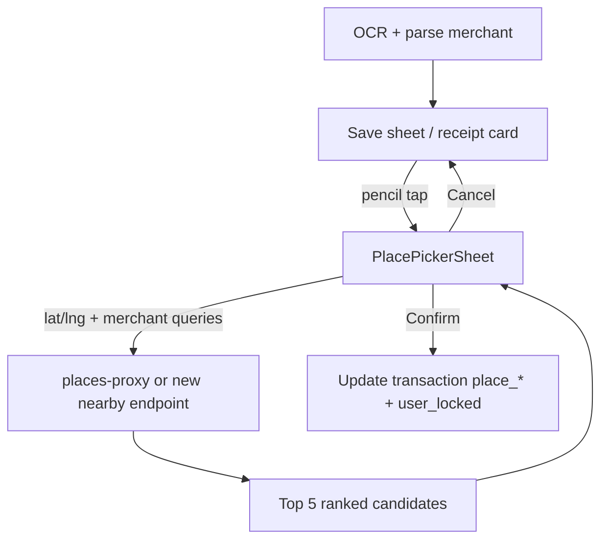

# Pending tasks

Backlog of planned work not yet implemented in the main app pipeline.

---

## Receipt line-item extraction (item + price pairs)

### Problem

The current ingest pipeline only extracts **receipt-level** fields:

- Total amount (`amountMyr`) via [`lib/domain/logic/rm_amount_parser.dart`](../lib/domain/logic/rm_amount_parser.dart)
- Merchant name via [`lib/domain/logic/merchant_extractor.dart`](../lib/domain/logic/merchant_extractor.dart)
- Category guess via [`lib/domain/logic/category_matcher.dart`](../lib/domain/logic/category_matcher.dart)

It does **not** parse individual purchased items or their prices. OCR returns full text (especially when using `-IncludeOcrText` on the batch script), but nothing structures that into line items.

The UI prototype in [`receipt_cards.dart`](../receipt_cards.dart) already shows the desired shape (`ReceiptItem`: name + price + optional emoji), but that data is **hardcoded demo content**, not wired to OCR or `TransactionView`.

[`lib/widgets/receipt_card.dart`](../lib/widgets/receipt_card.dart) currently renders a **single summary row** (merchant + total), not a list of items.

### Goal

Extract structured **item / price pairs** from receipt OCR text so the frontend can render an itemized receipt card without manual entry.

### Proposed domain model

Add a shared, frontend-friendly type (location TBD, e.g. `lib/domain/models/receipt_line_item.dart`):

```dart
class ReceiptLineItem {
  const ReceiptLineItem({
    required this.name,
    required this.priceMyr,
    this.quantity,
    this.confidence,
    this.lineIndex,
  });

  final String name;
  final double priceMyr;
  final int? quantity;       // when detectable, e.g. "2 x"
  final double? confidence;  // parser confidence for this row
  final int? lineIndex;      // source line in OCR text (debug / UI)
}
```

JSON shape for API / batch output / Supabase (stable for frontend):

```json
{
  "file": "rock_cafe.png.jpeg",
  "amountMyr": 42.5,
  "merchantRaw": "ROCK CAFE",
  "lineItems": [
    { "name": "Latte", "priceMyr": 12.5, "quantity": 1, "confidence": 0.82 },
    { "name": "Croissant", "priceMyr": 7.9, "quantity": 1, "confidence": 0.79 }
  ],
  "lineItemsConfidence": 0.8,
  "itemsSubtotalMyr": 20.4,
  "itemsMatchTotal": false
}
```

Frontend integration targets:

| Surface | Change |
|--------|--------|
| [`TransactionView`](../lib/domain/models/transaction_view.dart) | Add optional `List<ReceiptLineItem> lineItems` |
| [`ReceiptParseResult`](../lib/features/share/receipt_parse_pipeline.dart) | Include `lineItems` in `toJson()` |
| [`bin/process_receipts.dart`](../bin/process_receipts.dart) | Emit `lineItems` in `_results.json` |
| [`lib/widgets/receipt_card.dart`](../lib/widgets/receipt_card.dart) | Render multiple rows when `lineItems` is non-empty; fall back to current single-row layout |
| [`receipt_cards.dart`](../receipt_cards.dart) prototype | Replace hardcoded `ReceiptItem` lists with parsed data once available |

### Parser design (heuristic v1)

New module: `lib/domain/logic/receipt_line_item_extractor.dart`

**Input:** raw OCR text (same string used by `parseRmAmountFromOcr` / `extractMerchant`).

**Output:** `List<ReceiptLineItem>` + aggregate metadata.

**Suggested rules (Malaysian thermal receipts):**

1. Split OCR into lines; trim and skip empty lines.
2. Skip header/footer zones (reuse boilerplate hints from `merchant_extractor.dart` + total/tax/change lines matched by `rm_amount_parser` discount hints).
3. For each remaining line, try patterns in order:
   - `(.+?)\s+RM\s*([\d,]+\.\d{2})\s*$` — item left, price right (most common)
   - `(\d+)\s*x\s*(.+?)\s+RM\s*([\d,]+\.\d{2})` — quantity prefix
   - `(.+?)\s+([\d,]+\.\d{2})\s*$` — price without `RM` prefix (lower confidence)
4. Reject lines where the "name" is only digits/punctuation or matches total/subtotal/tax keywords.
5. Optionally cap to N items (e.g. 30) to avoid runaway OCR noise.
6. Compute `itemsSubtotalMyr` and set `itemsMatchTotal` when sum is within tolerance of parsed total (e.g. ±RM 0.05 or accounting for SST/service charge).

**Confidence:**

- Per line: based on pattern match quality + name length + price sanity.
- Overall: mean of line confidences, penalized if subtotal ≠ total.

### Pipeline integration



Update [`lib/features/share/receipt_parse_pipeline.dart`](../lib/features/share/receipt_parse_pipeline.dart):

- Call `extractReceiptLineItems(ocrText)` inside `parseReceiptOcrText`.
- Extend `ReceiptParseResult` with `lineItems`, `lineItemsConfidence`, `itemsSubtotalMyr`, `itemsMatchTotal`.

No change required to OCR service for v1 — line extraction runs on the same PaddleOCR / ML Kit text the app already receives.

### Persistence and sync (v2)

Not required for first frontend integration (can live on parse result only), but planned:

| Layer | Work |
|-------|------|
| Drift | New table `outbox_line_items` (`transaction_id`, `sort_order`, `name`, `price_myr`, `quantity`, `confidence`) |
| Supabase | Migration: `receipt_line_items` table + RLS mirroring `transactions` |
| [`SyncWorker`](../lib/data/repositories/sync_worker.dart) | Upsert line items after transaction sync |
| [`IngestReceiptRequest`](../lib/data/repositories/ingest_receipt_request.dart) | Accept optional `lineItems` on save |

### Testing

| Test file | Cases |
|-----------|--------|
| `test/receipt_line_item_extractor_test.dart` | Typical cafe receipt; grocery multi-line; total/tax lines excluded; quantity prefix; empty OCR; mismatched subtotal |
| `test/receipt_parse_pipeline_test.dart` | `parseReceiptOcrText` includes `lineItems` when OCR fixture has item rows |
| `services/ocr-api/tests/` | Optional: end-to-end fixture asserting item lines appear in OCR text before Dart parsing |

Fixtures: add `test/fixtures/ocr/` with sample receipt text snippets (no binary images required for unit tests).

### Acceptance criteria

- [ ] `extractReceiptLineItems` returns name + `priceMyr` for ≥2 items on a standard itemized receipt OCR fixture.
- [ ] Total/subtotal/tax/change lines are **not** included as line items.
- [ ] `ReceiptParseResult.toJson()` includes `lineItems` array (empty when none found).
- [ ] Batch script `_results.json` includes `lineItems` per file when `-IncludeOcrText` or always (TBD).
- [ ] `ReceiptCard` shows item rows when `TransactionView.lineItems` is non-empty.
- [ ] Existing flows without line items behave unchanged (backward compatible).

### Out of scope (for this task)

- Per-item category classification
- SKU / barcode extraction
- Multi-page PDF line-item tables
- LLM-based parsing (heuristics first)

### Related files (current)

- OCR: [`lib/features/share/ocr_pipeline_io.dart`](../lib/features/share/ocr_pipeline_io.dart), [`services/ocr-api/`](../services/ocr-api/)
- Parse pipeline: [`lib/features/share/receipt_parse_pipeline.dart`](../lib/features/share/receipt_parse_pipeline.dart)
- Batch tool: [`bin/process_receipts.dart`](../bin/process_receipts.dart), [`scripts/process_receipts.ps1`](../scripts/process_receipts.ps1)
- UI prototype: [`receipt_cards.dart`](../receipt_cards.dart)
- Production card: [`lib/widgets/receipt_card.dart`](../lib/widgets/receipt_card.dart)

---

_Add new pending tasks below as separate `##` sections._

---

<!--
DONE (2026-07-08): Post-OCR vendor location picker (Grab-style nearby suggestions).
Implemented as planned — `supabase/functions/places-proxy/index.ts` extended with
a `nearby_candidates` mode (concurrent searchText + searchNearby, same
`scoreCandidate()` scoring as enrichment, returns top-5 ranked candidates with
`{id, name, address, lat, lng, distanceMeters, confidence}`). New
`lib/features/places/place_picker_screen.dart` full-screen picker opened via
`PlacePickerScreen.push()` (rootNavigator, works from inside AdaptiveSheet modals).
Pencil icon added to `share_save_sheet.dart` merchant row (shown when
`shareLocationLat != null`); `_pickPlace()` in `transaction_detail_screen.dart`
opens picker when location is available, falls back to 'places-search' text search.
`TransactionRepository.updateTransactionPlace()` writes `placeStatus='user_locked'`
and re-queues sync; `ingestReceipt()` also handles pre-save user lock. New fields:
`PlaceCandidate` in `places_repository.dart`, `shareLocationLat/Lng` on
`TransactionView`, `pickedPlace*` fields on `ReceiptIngestDraft` /
`IngestReceiptRequest`. ADR in `docs/decisions.md`, API docs in `docs/api.md`,
feature graph in `memory/feature_graph.md`.
-->

## Post-OCR vendor location picker (Grab-style nearby suggestions)

### Problem

After OCR, the app shows a parsed **merchant name** (e.g. on [`ShareSaveSheet`](../lib/features/share/share_save_sheet.dart) and [`ReceiptCard`](../lib/widgets/receipt_card.dart)) and later auto-assigns a **place** via [`enrich-transaction`](../supabase/functions/enrich-transaction/index.ts) (Google Places text + nearby search within **300 m**, see `SEARCH_RADIUS_METERS` in [`place_matching.ts`](../supabase/functions/_shared/place_matching.ts)).

When the guessed place is wrong, the only correction path today is the generic **text search** flow ([`PlacesSearchScreen`](../lib/features/places/places_search_screen.dart) → [`PlacesRepository.search`](../lib/data/repositories/places_repository.dart) → `places-proxy`). That is slow, requires typing, and does not surface the nearby candidates enrichment already considered.

There is no quick “pick from nearby matches” UI comparable to Grab’s pickup-point selector (map + scrollable location list + live pin/camera sync).

### Goal

Let the user **correct the vendor location after OCR** with a Grab-like experience:

1. Show a **pencil icon** next to the vendor / place name (post-OCR save sheet, receipt card, and/or transaction detail — exact surfaces TBD).
2. On tap, open a **bottom sheet / full-screen picker** that shows the **top 5 most related vendors** within the existing **300 m** search radius (ranked by the same text/distance scoring enrichment uses, or a client-side equivalent).
3. **Map + list stay in sync** (reference: Grab pickup UI — map on top, selectable location rows at bottom):
   - Tapping a row **immediately** pans the map camera to that candidate and drops a **red pin** at its coordinates.
   - The selected row is highlighted (Grab uses a tinted background on the active row).
4. User taps **Confirm** to apply the choice, or **Cancel** to discard.

### UX reference

Grab pickup selector (attached screenshot): map with multiple green pins in a cluster, a “Nearest” callout, and a bottom panel listing specific lobby/shoplot names with distance. Receipt Drop should mirror the **interaction model**, not the Grab branding:

| Grab pattern | Receipt Drop adaptation |
|--------------|-------------------------|
| Bottom list of specific sub-locations | Top **5** nearby place candidates (building/POI names from Places) |
| Row tap selects + highlights | Same; selected row highlighted |
| Map camera follows selection | `flutter_map` camera animates to `(lat, lng)` |
| Pin at selected point | **Red** pin marker (distinct from spend-map friend pins) |
| Primary CTA “Choose This Pickup” | **Confirm** (applies place) + **Cancel** |

Optional v2: distance label per row (e.g. `0.02 km`) and a “Nearest” badge on the closest high-confidence match.

### Data / API design

Enrichment already searches ~300 m, but **does not persist the full candidate list** on the transaction today — only the winning `place_*` fields. The picker needs a candidate source. Pick one (or combine):

**Option A — On-demand nearby fetch (recommended for v1)**

- New Edge Function endpoint (or extend `places-proxy`) accepting `{ lat, lng, query?, merchant_candidates? }`.
- Reuse [`place_matching.ts`](../supabase/functions/_shared/place_matching.ts) scoring (`diceCoefficient`, `distanceScore`, `haversineMeters`) server-side.
- Return top **5** `{ place_id, name, lat, lng, distance_m, confidence }`.
- Called when the picker opens, using **share capture location** + OCR merchant text / ranked [`MerchantCandidate`](../lib/domain/logic/merchant_extractor.dart) list.

**Option B — Persist enrichment candidates**

- Extend `transactions` (and local outbox) with `place_candidates jsonb` written by `enrich-transaction`.
- Picker reads cached candidates when user edits later; fallback to Option A if empty/stale.

On confirm, write the same fields as manual place change today:

- `place_name`, `place_google_place_id`, `place_lat`, `place_lng`
- `place_status = 'user_locked'` (see [`docs/api.md`](../docs/api.md) — skips automatic re-enrichment)
- Optionally bump `place_confidence` to 1.0 or a fixed “user picked” value

### UI components (proposed)

| Piece | Location / notes |
|-------|------------------|
| Pencil affordance | `Icon(Icons.edit_outlined)` beside merchant/place label on save sheet + detail surfaces |
| `PlacePickerSheet` (new) | Modal route or `DraggableScrollableSheet`: top ~55% map, bottom list |
| Map layer | Reuse [`flutter_map`](../lib/features/map/spend_map_screen.dart) stack; dedicated red pin widget |
| List row | Place name, distance, optional address snippet; selected state styling |
| Actions | Sticky footer: **Confirm** (primary) + **Cancel** (text/secondary) |

State: hold `selectedCandidate` locally; only persist on Confirm.

### Pipeline integration



Surfaces to wire (minimum):

- [`ShareSaveSheet`](../lib/features/share/share_save_sheet.dart) — merchant line gets pencil; draft carries optional `placeName` / coords before first save
- [`TransactionDetailScreen`](../lib/features/tx_detail/transaction_detail_screen.dart) — replace or supplement “Change place” text search with nearby picker when capture location exists
- [`PlaceBlock`](../lib/widgets/place_block.dart) — upgrade static map placeholder to live preview during edit

### Testing

| Test | Cases |
|------|--------|
| `place_matching.ts` / new endpoint unit tests | Ranking returns ≤5; respects 300 m radius; orders by combined score |
| Widget test `PlacePickerSheet` | Row tap updates selected index + pin position; Confirm emits `PlaceResult`; Cancel pops without write |
| Integration | Save sheet → pick alternate nearby place → transaction persists `user_locked` → re-sync does not overwrite |

Fixtures: reuse [`receipts/rock_cafe.png.jpeg`](../receipts/rock_cafe.png.jpeg) OCR merchant + a mocked Places nearby response.

### Acceptance criteria

- [ ] Pencil icon visible next to vendor/place name on at least the post-OCR save sheet.
- [ ] Picker shows **≤ 5** nearby place suggestions ranked by relevance (not an empty text-search field).
- [ ] Selecting a list row **immediately** moves the map camera and shows a **red pin** at that location.
- [ ] **Confirm** updates `place_*` and sets `place_status = 'user_locked'`; **Cancel** leaves data unchanged.
- [ ] Works when share-location lat/lng is available; graceful fallback (hide picker or show text search) when location is missing.

### Out of scope (for this task)

- Sub-POI granularity inside a mall (Grab’s “Tower 3A/3B Lobby” level) unless Places returns those as distinct candidates
- Editing merchant **name** text (place correction only)
- Re-running OCR
- Showing enrichment’s internal alias fast-path in the UI

### Related files (current)

- OCR → save: [`share_save_sheet.dart`](../lib/features/share/share_save_sheet.dart), [`receipt_ingest_draft.dart`](../lib/features/share/receipt_ingest_draft.dart)
- Manual place change: [`places_search_screen.dart`](../lib/features/places/places_search_screen.dart), [`places_repository.dart`](../lib/data/repositories/places_repository.dart)
- Enrichment / 300 m search: [`enrich-transaction/index.ts`](../supabase/functions/enrich-transaction/index.ts), [`place_matching.ts`](../supabase/functions/_shared/place_matching.ts)
- Map stack: [`spend_map_screen.dart`](../lib/features/map/spend_map_screen.dart)
- Place display: [`place_block.dart`](../lib/widgets/place_block.dart), [`transaction_view.dart`](../lib/domain/models/transaction_view.dart)

---

<!--
DONE (2026-07-08): Merchant candidate ranking: real font-size / bounding-box
signal. Implemented as planned — `services/ocr-api/app/ocr_engine.py` now
exposes `run_ocr_detailed()` returning per-line `height_ratio` (median word
bbox height / image height), threaded through `OcrResponse.lines` ->
`OcrApiResult.lines` -> `OcrFileResult.lines` -> `parseReceiptOcrText(ocrLines:
...)` -> `extractMerchantCandidates(ocrLines: ...)`, which adds a `'largeText'`
source tier (confidence 0.80, must clear 1.4x the receipt's median line
height) between the keyword tiers and the position fallback. Fully additive —
`null`/absent `ocrLines` behaves identically to before. See
`docs/decisions.md` for the ADR entry and `memory/feature_graph.md` for the
updated dependency list.
-->

