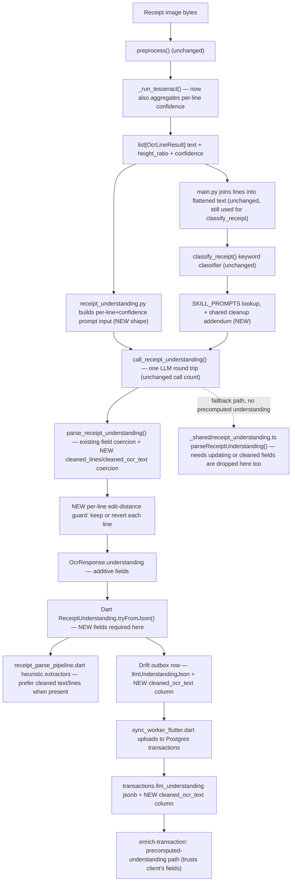

# Architecture Review: LLM-Based OCR Cleanup & Correction Stage

## Feature Summary

Extend the existing single synchronous LLM call in `services/ocr-api` (`call_receipt_understanding()` in [receipt_understanding.py](services/ocr-api/ocr_api/receipt_understanding.py)) so its response also carries a line-aligned, mechanically-corrected OCR transcript (character-confusion fixes, spacing, broken words) alongside the fields it already extracts. A per-line, non-LLM edit-distance guard discards any single line's correction that looks rewritten/hallucinated rather than lightly fixed; the original OCR text is never overwritten. No new LLM call, no new service — this is a schema/prompt extension of an existing, already-paid-for round trip.

## Current Architecture Understanding

**Components involved:**
- [ocr_api/ocr_engine.py](services/ocr-api/ocr_api/ocr_engine.py): `_run_tesseract()` builds `OcrLineResult{text, height_ratio}` per line and a single scalar `mean_confidence`; per-word `conf` values are summed into `confidences` then discarded (`ocr_engine.py:120-131,151-152`) — never kept per line. `_normalize_ocr_amounts()` already does exactly one narrow correction: digit-confusion inside `RM<amount>` tokens only, via a `str.maketrans` substitution (`ocr_engine.py:33-53`), applied line-by-line at line-construction time.
- [ocr_api/receipt_understanding.py](services/ocr-api/ocr_api/receipt_understanding.py): `call_receipt_understanding()` takes a single flattened `ocr_text: str` (already joined from lines by the caller), builds one skill-routed prompt via `_build_messages()`, POSTs it, and returns a `ReceiptUnderstandingResponse` parsed by `parse_receipt_understanding()` — every field defensively coerced, "the LLM's output is a hint, this function is the authority" (its own docstring, line 292-296).
- [ocr_api/skills/](services/ocr-api/ocr_api/skills/): `orchestrator.py`'s `classify_receipt()` is a zero-LLM keyword classifier returning one of 8 `receipt_type` values (`restaurant, cafe, payment, grocery, retail, transport, travel, unknown`). **Correction to the spec's premise**: there are only **four** prompt files — `restaurant.py`, `grocery.py`, `payment.py`, `transport.py` (confirmed via `Glob`; there is no `cafe.py`). `skills/__init__.py`'s `SKILL_PROMPTS` dict maps all 8 `receipt_type` keys onto these 4 prompts (`cafe`→restaurant, `retail`→grocery, `travel`→transport, `unknown`→restaurant). The spec's "five existing skill system prompts... not five independently maintained copies" language is based on a miscount — it's 4 files, not 5 — though the conclusion (single shared block, composed into each) is unaffected and still correct.
- [ocr_api/main.py](services/ocr-api/ocr_api/main.py) `POST /ocr`: runs `preprocess()` → `run_ocr_detailed()` → (if `text.strip()`) `call_receipt_understanding()`, catching **only** `ReceiptUnderstandingError` (`main.py:193-203`) around that call. Any other exception raised inside the call chain (including inside `parse_receipt_understanding()`) is **not** caught here and would 500 the whole `/ocr` response — contradicting the route's own stated contract ("A failed/timed-out LLM call must never fail this response: OCR already succeeded and its output is usable on its own," `main.py:188-189`).
- Client: [receipt_parse_pipeline.dart](lib/features/share/receipt_parse_pipeline.dart)'s `parseReceiptOcrText()` runs the heuristic Dart extractors against raw `ocrText` unconditionally, then lets a non-null `understanding` override merchant/category/line-items/payment-amount — never raw text/lines today.
- Persistence/sync chain (verified, not assumed): `transaction_repository_native.dart:98-103` builds the local outbox row's `llmUnderstandingJson` via `jsonEncode(request.understanding!.toJson())` — a **round-trip through the Dart `ReceiptUnderstanding` model** ([lib/domain/models/receipt_understanding.dart](lib/domain/models/receipt_understanding.dart)), not a pass-through of ocr-api's raw JSON. `sync_worker_flutter.dart:118-120` then `jsonDecode`s that same string into Postgres `transactions.llm_understanding jsonb` (added by `20260709000000_llm_understanding.sql`) verbatim.
- **Not scoped in the spec's own "System Impact," but load-bearing**: [supabase/functions/_shared/receipt_understanding.ts](supabase/functions/_shared/receipt_understanding.ts) is a second, hand-maintained port of the exact same schema/vocab (confirmed by `receipt_understanding.py`'s own module docstring: "must stay in sync with `supabase/functions/_shared/receipt_understanding.ts`," and by `docs/system/decisions.md`'s 2026-07-10 entry: "`ALLOWED_PLACE_TYPES`/`VENDOR_CATEGORIES`/the system prompt now exist in **two** places... that must be kept in sync by hand"). `enrich-transaction/index.ts:171-182` re-validates the client-synced `llm_understanding` blob through this TS `parseReceiptUnderstanding()` before trusting it, and falls back to calling ocr-api's `/understand` itself (going through the *same* Python skill/prompt path) when no usable precomputed understanding exists (`index.ts:191-301`).

**Existing patterns this feature should follow:**
- Opt-in env flags gating new pipeline stages (`PREPROCESS_CLAHE`, `PREPROCESS_SHARPEN`, `PREPROCESS_ILLUMINATION` in `preprocessing.py`), read via `os.environ.get(...)` at call time, not import time (so tests can `monkeypatch.setenv`).
- "Hint, not authority" defensive coercion for every LLM-derived field in `parse_receipt_understanding()` — wrong types dropped, nothing raised for malformed input.
- Additive-only response schema changes with a doc comment justifying it (`OcrLine`'s "optional so an older client reading just text/confidence is unaffected," `models.py:14-17`).
- Pure, independently-unit-testable helper functions for narrow corrections (`_normalize_ocr_amounts`, `_calibrate_confidence`).

**Important constraints:**
- `LLM_TIMEOUT_SECONDS=25s`, synchronous, on the capture-time critical path (2026-07-10 decision) — this is the tightest latency budget in the pipeline.
- `raw_ocr_text` is written once, never overwritten, per the 2026-07-09 decision.
- `transactions.amount_myr` has exactly one authority chain today: heuristic parser + structured LLM fields + heuristic cross-check. Nothing currently reads free-form OCR/cleaned text to derive an amount.
- Schema is additive-compatible by convention (current Drift `schemaVersion` is 9, confirmed in `app_database.dart:30`).

## Impact Analysis

### Client
- **Screens**: none directly; no new UI per the spec's own "backend-only change" framing — reasonable, this is purely a data-quality improvement feeding existing screens.
- **Services/models**: `lib/domain/models/receipt_understanding.dart`'s `ReceiptUnderstanding.tryFromJson()`/`toJson()` **must** gain the new cleaned fields, not just `receipt_parse_pipeline.dart`. This is a load-bearing prerequisite the spec's Implementation Guidance (step 7) understates: because `llmUnderstandingJson` is populated by re-serializing this Dart model (`transaction_repository_native.dart:99-103`), skipping this model update means cleaned fields are silently dropped before they're ever locally stored — they'd never reach Drift, let alone Postgres, even if ocr-api returns them correctly.
- **State management**: `ReceiptParseResult` (`receipt_parse_pipeline.dart`) would gain new fields for cleaned text/lines, following the existing `understanding`/`understandingError` nullable-field pattern already there.
- **User flows**: none change; this is additive input quality, not new interaction.

### Backend
- **APIs**: `POST /ocr`'s response schema grows (additive fields inside `understanding`); `POST /understand` (used by `enrich-transaction`'s fallback path) shares the exact same `ReceiptUnderstandingResponse`, so it gains the fields too, for free, since both endpoints go through `call_receipt_understanding()`/`parse_receipt_understanding()`.
- **Services**: `ocr_engine.py` needs per-line confidence surfaced (currently computed per-word, discarded after the mean); `receipt_understanding.py` needs the input reshaped from flattened text to a per-line(+confidence) structure, new response fields, and the edit-distance guard; `skills/` needs a shared cleanup-instruction block composed into its 4 (not 5) prompt files.
- **Processing pipelines**: no new pipeline stage/service — this stays inside the one existing LLM step, consistent with the spec's central design choice.

### Database
- **Schema changes**: new column(s) on `transactions` — `cleaned_ocr_text` (text) and a corrections record (jsonb, or folded into existing `llm_understanding`). A new migration following `20260709000000_llm_understanding.sql`'s pattern (`alter table ... add column if not exists`, owner-scoped, no new RLS policy needed).
- **Data models**: Drift needs a mirroring local column (same v6→v7-style `_addColumnIfAbsent` pattern already used for `llmUnderstandingJson`, confirmed in `app_database.dart:59-95`).
- **Migration needs**: additive-only, no backfill needed (existing rows simply have `null`), consistent with this repo's stated rollback-safety discipline.

### Infrastructure
- No new service, no new dependency, same LLM gateway. `LLM_MAX_TOKENS` (1200 today) will need re-tuning — a real, measurable cost, not a footnote (see Performance Considerations).

## Recommended Architecture Approach

Adopt the spec's recommended approach (merge into the existing call) largely as designed — it correctly avoids a second LLM round trip on the pipeline's tightest latency budget, and correctly keeps `transactions.amount_myr`'s authority chain untouched. Two structural adjustments are worth making relative to the spec as written:

1. **Wrap the new parsing/guard logic in an explicit internal exception boundary inside `receipt_understanding.py`**, mirroring the fix already applied for the illumination-preprocessing stage's own gap in `main.py`'s exception handling. `main.py` only catches `ReceiptUnderstandingError` around `call_receipt_understanding()` (`main.py:193-203`); any bug in a new pure-Python edit-distance/low-text-floor helper that raises something else (e.g. a `TypeError` on an unexpected shape) would propagate uncaught and 500 the entire `/ocr` request — even though OCR itself already succeeded. The new guard code should catch broadly and degrade to "keep original line, log it" rather than let an internal bug escalate to a full-request failure — this is the exact same category of risk flagged and fixed for `preprocess()` in the prior review/implementation.
2. **Treat the TS mirror (`supabase/functions/_shared/receipt_understanding.ts`) as in-scope for a sync decision, even if no code there changes.** The spec's own "System Impact" section scopes changes to `services/ocr-api` only, but `enrich-transaction`'s fallback path (`index.ts:191-301`) reconstructs a `ReceiptUnderstanding` object via this TS file's own `parseReceiptUnderstanding()` from the raw LLM completion — it does not defer to whatever Python parsed. If the TS type/parser isn't updated, any receipt understood via that fallback path (not the client-synced happy path) will have its cleaned fields silently dropped by TS's own defensive parsing before they ever reach `llm_understanding` jsonb — a second, harder-to-notice place cleaned text can vanish, beyond the Dart-model gap already noted above. This should be an explicit decision (extend TS too vs. accept that fallback-path receipts never get cleaned text), not an oversight.

What should be reused: `_run_tesseract()`'s existing per-word `conf` array (just don't discard it after the mean); `parse_receipt_understanding()`'s existing defensive-coercion style; the `SKILL_PROMPTS` indirection (already built for exactly this kind of shared-vs-per-type prompt composition); the `PREPROCESS_*`-style env-gating convention; the `OcrLine`-style "optional, additive" schema discipline.

What should be added: a per-line confidence figure threaded from `ocr_engine.py` through `models.py`'s `OcrLine`; a small shared cleanup-instruction string (new, e.g. a `_shared.py`-style module under `skills/`, since none of the 4 prompt files currently import from a common place — each is a standalone module-level string); the edit-distance guard and low-text-floor as pure functions; new optional response fields; a new Postgres column + Drift column + Dart model fields.

## Proposed Changes

### New Components
- A shared cleanup-instruction prompt fragment (new small module, e.g. `ocr_api/skills/_cleanup_instructions.py` or a constant in `skills/__init__.py`) composed into the string returned by each of the 4 existing prompt files — no existing shared-prompt module exists today to extend.
- Pure helper functions in `receipt_understanding.py` (or a new sibling module) for the per-line edit-distance ratio and the low-word-count skip floor — following the existing pure-helper pattern (`_calibrate_confidence`, `_normalize_ocr_amounts`).
- New Postgres migration (`cleaned_ocr_text` + corrections record) mirroring `20260709000000_llm_understanding.sql`.
- New Drift column + migration step mirroring `llmUnderstandingJson`'s addition.

### Modified Components
- `ocr_engine.py`: `_run_tesseract()`/`OcrLineResult` gain per-line aggregated confidence (currently only a per-request mean is kept).
- `models.py`: `OcrLine` gains a confidence field, additive/optional per existing convention.
- `receipt_understanding.py`: `_build_messages()`/`_body()` input changes from flattened string to per-line(+confidence) structure; `ReceiptUnderstandingResponse` gains optional cleanup fields; `parse_receipt_understanding()` gains defensive coercion + the edit-distance guard, wrapped so internal failures degrade rather than propagate (see Recommended Architecture Approach).
- 4 skill prompt files: each gains the shared cleanup addendum appended to its existing `SYSTEM_PROMPT` string.
- `lib/domain/models/receipt_understanding.dart`: new fields on `tryFromJson()`/`toJson()` — a prerequisite for the fields to survive local persistence at all, distinct from and prior to using them in extraction.
- `lib/features/share/receipt_parse_pipeline.dart`: new optional cleaned-text/lines input, preferred over raw OCR text where the heuristic extractors read it today, without changing the heuristic-vs-LLM-structured-field precedence order already established (2026-07-10 decision).
- `supabase/functions/_shared/receipt_understanding.ts` (open decision — see Open Questions): possibly extended in parallel so the fallback-call path doesn't silently lose cleaned fields.

### Removed Components
None. `_normalize_ocr_amounts()` stays as the fast, zero-latency first pass, unchanged, per the spec's own explicit non-goal.

## Data Flow

## Implementation Plan

1. Surface per-line aggregated confidence in `ocr_engine.py` (`_run_tesseract`/`OcrLineResult`), self-contained, independently testable against existing fixtures.
2. Thread that confidence through `models.py`'s `OcrLine` (or an internal-only structure if it shouldn't reach the client-facing response as-is).
3. Add the shared cleanup-instruction prompt fragment; compose it into the 4 actual skill prompt files (not 5).
4. Extend `ReceiptUnderstandingResponse`/`parse_receipt_understanding()` with the new optional fields, following the existing defensive-coercion style, and wrap the new parsing/guard logic so it cannot raise past its own boundary.
5. Implement the per-line edit-distance guard and low-word-count skip floor as pure, independently unit-tested functions.
6. Bump `LLM_MAX_TOKENS`, re-measure real response sizes/latency via `scripts/process_receipts.ps1` against long receipts before assuming it's shippable.
7. Extend `lib/domain/models/receipt_understanding.dart` first (prerequisite for persistence), then wire client consumption in `receipt_parse_pipeline.dart`, then the new Drift column, then the Postgres migration.
8. Decide and implement (or explicitly defer with a documented reason) the `supabase/functions/_shared/receipt_understanding.ts` side, so the fallback-call path's behavior is a deliberate choice, not an accidental gap.
9. Ship env-gated and defaulted off; validate via the batch tool before flipping on, mirroring the illumination-correction rollout.

## Tradeoff Analysis

**Recommended (merged single call), as the spec proposes**: lowest latency/cost impact, reuses the already-solved skill-routing/response-validation machinery, keeps one LLM failure mode instead of two. Disadvantage: couples cleanup's prompt/response complexity to the same call that does structured extraction, growing that one call's blast radius (a bigger prompt/response makes the 25s timeout budget tighter, and a schema-shape bug now risks both structured extraction and cleanup in one failure).

**Alternative — separate cleanup call before understanding**: cleaner single responsibility, independently versionable/testable in isolation. Rejected correctly by the spec: doubles round trips on the tightest latency budget in the pipeline, and duplicates correction work the existing call already partially performs (merchant name, line items).

**Alternative — structured-field-only corrections (no free-form cleaned transcript)**: smaller output/validation surface, lower hallucination risk. Rejected correctly by the spec: does not help the client's heuristic Dart extractor, which reads raw text/lines directly regardless of LLM success (2026-07-10 decision) — this is the entire second half of the feature's stated value.

**Edit-distance guard vs. confidence-threshold-only guard**: the spec's reasoning holds structurally — a confidently-misread character isn't flagged by Tesseract's own confidence, so a confidence-only guard would let through exactly the hardest, most dangerous corrections. Edit-distance is a legitimately different, complementary axis. No changes recommended here.

## Risks and Mitigations

| Risk | Impact | Mitigation |
|------|--------|------------|
| New parsing/guard code raises an uncaught exception inside `parse_receipt_understanding()`, escaping `main.py`'s narrow `except ReceiptUnderstandingError` | `/ocr` 500s even though OCR itself succeeded — violates the route's own stated contract | Wrap new guard/coercion logic in its own broad `try/except`, degrade to "no cleanup, keep raw" on any internal failure, matching the fix already made for `preprocess()`'s equivalent gap |
| Cleaned fields silently dropped before persistence because the Dart `ReceiptUnderstanding` model isn't updated | Feature "ships" server-side but produces no client-visible or persisted benefit; easy to miss in testing if server-side tests pass | Update `receipt_understanding.dart`'s `tryFromJson()`/`toJson()` as an explicit, separately-verified implementation step, not folded silently into the heuristic-wiring step |
| Cleaned fields dropped specifically on the `enrich-transaction` fallback path because `_shared/receipt_understanding.ts` doesn't know about them | Inconsistent behavior depending on which code path produced a transaction's understanding — hard to notice, hard to debug later | Decide explicitly (extend TS in lockstep, or document the asymmetry) rather than let it fall out unnoticed; add to Open Questions |
| Longer prompt (per-line + confidence) and longer generated response eat into the already-tight `LLM_TIMEOUT_SECONDS=25s` budget | Increased timeout rate on the capture-time critical path, degrading the "instant save" UX this pipeline is built around | Measure actual added latency via `scripts/process_receipts.ps1` before shipping; the spec already flags this, treat it as a hard go/no-go gate, not an assumption |
| A structurally low-edit-distance but wrong digit swap (e.g. "RM15.00"→"RM75.00") passes the guard | A believable wrong total in `cleaned_ocr_text` | Already correctly mitigated structurally by the spec: `amount_myr` never reads `cleaned_ocr_text`; this is an acknowledged residual risk of the transcript itself, not the transaction record |
| Skill-prompt drift if the shared cleanup block is copy-pasted into the 4 files instead of composed from one string | Same class of risk decisions.md already documents for the Python/TS schema duplication | Compose from a single constant/function, not hand-copied text, as the spec itself specifies |
| `ocr_api/skills/` (the orchestrator system) has no `docs/system/decisions.md` entry despite being real, load-bearing code | Future agents/engineers may under-trust or rediscover this system from scratch | Not this feature's responsibility to fix, but worth flagging in the eventual decisions.md entry for this feature as a pre-existing gap noticed along the way |

## Testing Strategy

- **Unit tests** (`services/ocr-api/tests/test_receipt_understanding.py`, existing `httpx.MockTransport` pattern, no real network): mock LLM responses containing low-edit-distance legitimate corrections and high-edit-distance pathological ones, assert the guard keeps the former and reverts the latter, per line; assert the request payload sent to the mock actually contains per-line confidence structure (verifying the prompt-input reshape, not just prompt text).
- **False-correction / no-op regression**: feed already-correct, high-confidence fixtures through the new path, assert near-zero line changes — the direct test of "avoid changing what shouldn't be changed," same category as the illumination stage's `test_normalize_illumination_skips_clean_image`.
- **Exception-boundary test**: force the new guard/coercion code to raise (monkeypatch or malformed input) and assert `/ocr` still returns 200 with raw fields only and cleanup fields null — the specific regression this review flags as the main structural risk.
- **Route schema-regression test** (`test_main.py`, existing `test_ocr_response_schema_unchanged_with_new_preprocess_flags`-style pattern): extend with the new env flag(s) if introduced, and assert `understanding`'s new fields are additive/optional in the response shape.
- **Batch-tool evaluation**: extend `scripts/process_receipts.ps1`/`bin/process_receipts.dart` runs against real receipts with manually-verified amounts/merchants; compare structured-field accuracy and line-level correction precision/recall on a small hand-labeled sample, before vs. after.
- **Internal-consistency check** (flagged by the spec's own Edge Cases): assert the cleaned transcript's merchant line agrees with the same response's structured `merchant_name` field — a genuinely new risk introduced by having two derived-from-the-same-input fields that could diverge.
- **Cross-system test not in the spec**: if `_shared/receipt_understanding.ts` is extended, add/extend a Deno test asserting the fallback path (`enrich-transaction` calling `/understand` itself) preserves cleaned fields identically to the client-synced happy path.

## Performance Considerations

- **Latency**: correctly framed by the spec as additive prompt/response size on an existing call, not a new round trip — but this is not free. Per-line + confidence input is strictly larger than a flattened string; a full cleaned transcript output for a 20-30 line receipt is a meaningfully larger generation than today's structured-field-only response. Must be measured against `LLM_TIMEOUT_SECONDS=25s`, not assumed negligible.
- **`LLM_MAX_TOKENS` (1200 today)**: will need re-tuning; this has already happened once for `line_items` (per the in-code comment) and a full transcript is a bigger addition than that was.
- **`MAX_OCR_PROMPT_CHARS` (6000)**: correctly left unchanged by the spec — a receipt long enough to be truncated already loses structured-extraction accuracy on its tail today; no new limitation introduced.
- **Cost**: token cost per request increases (longer input + output), but stays at one call per receipt — correctly identified as the central argument for this design over a separate call.
- **Caching**: not applicable, correctly noted — no natural repeat key per unique receipt image.

## Security Considerations

- **Preventing hallucinated values**: primary mitigation (edit-distance guard + low-text floor) is sound for its stated scope; the spec is explicit and correct that it cannot catch a plausible-looking wrong digit swap, and structurally routes around that by never letting `cleaned_ocr_text` become an amount source. This review has no changes to recommend here — it is a well-reasoned, explicitly-acknowledged residual risk, not an oversight.
- **Amount authority**: the hard constraint ("no new route to `transactions.amount_myr`") is correctly the single most important property of this design. It should be enforced by tests (see Testing Strategy), not just prose, once implemented — assert nothing in the new code path ever calls the heuristic amount parser against `cleaned_ocr_text`.
- **Auditability**: `cleaned_ocr_text` alongside untouched `raw_ocr_text` plus a per-line corrections record gives a clear diff; consistent with existing debugging conventions in `main.py`.
- **Auth/data privacy**: no new surface — same `X-OCR-Secret`-gated endpoints, same LLM gateway already trusted with full OCR text.

## Open Questions

- Should `supabase/functions/_shared/receipt_understanding.ts` be extended in lockstep so the `enrich-transaction` fallback-call path preserves cleaned fields, or is it acceptable that only the client-synced happy path ever carries them? This is a real behavioral asymmetry the spec's own scoping ("Backend services (services/ocr-api only)") doesn't address, and should be a deliberate decision.
- Does `cleaned_ocr_text`/the corrections record need to be its own top-level Postgres column (as the spec proposes) or could it be folded into the existing `llm_understanding` jsonb blob, avoiding a new migration entirely? The spec leaves this open ("either its own jsonb column or folded into the existing blob") — worth resolving before writing the migration, since `raw_ocr_text` (a comparable full-text field) is its own column, suggesting `cleaned_ocr_text` should be too for consistency/queryability, but this hasn't been explicitly decided.
- What specific edit-distance ratio threshold and low-text-floor word count are safe defaults? The spec leaves both "tunable" without a starting number — will need batch-tool-driven tuning against real receipts, similar to how `_LOW_CONFIDENCE_RETRY_THRESHOLD` (0.4) and `_RETRY_TIME_BUDGET_SECONDS` (20.0) were arrived at in `ocr_engine.py`.
- Is the per-line confidence figure ever exposed in the client-facing `OcrLine` response, or kept purely internal to the prompt-building step? The spec calls this "an implementation choice, not required" — worth deciding early since it affects whether `models.py`'s public `OcrLine` schema changes at all.

## Implementation Notes for Coding Agent

- **Read first**: `services/ocr-api/ocr_api/receipt_understanding.py` (full file — the call/schema/parsing to extend); `ocr_api/ocr_engine.py` (`_run_tesseract`, `OcrLineResult`, `_normalize_ocr_amounts` — this review confirms the narrow fix it complements, don't duplicate it); `ocr_api/skills/__init__.py` and `orchestrator.py` (confirms exactly 4 prompt files behind 8 `receipt_type` keys — do not assume 5 files); `ocr_api/models.py`; `ocr_api/main.py` lines ~137-213 (confirms the exception-boundary gap this review flags).
- **Also read before touching client code** (not covered by the spec's own research, now covered by this review): `lib/domain/models/receipt_understanding.dart` (the Dart model that must gain the new fields for them to survive persistence at all) and `lib/data/repositories/transaction_repository_native.dart:98-103` (confirms `llmUnderstandingJson` is built by re-serializing that Dart model, not passing through raw JSON).
- **Patterns to follow**: `PREPROCESS_*`-style env gating read via `os.environ.get(...)` at call time (not import time, for testability); the defensive-coercion style already in `parse_receipt_understanding()` (every field type-checked, nothing raised on bad input); pure, independently-testable helper functions (`_calibrate_confidence`, `_normalize_ocr_amounts`) as the template for the new edit-distance guard.
- **Things to avoid**: don't assume there are 5 skill prompt files — there are 4, with `SKILL_PROMPTS` aliasing the other 4 `receipt_type` values onto them; don't let any new parsing/guard code raise past its own boundary (wrap it, following the fix already made for `preprocess()`'s equivalent gap); don't let `cleaned_ocr_text` become reachable from any amount-parsing code path, client or server; don't assume the Dart-side wiring is "just" the heuristic-extractor step described in the spec's step 7 — the model layer underneath it needs updating first.
- **Suggested implementation sequence**: server-side schema/engine changes first (self-contained, testable in isolation) → prompt changes → guard implementation → `LLM_MAX_TOKENS`/latency validation via the batch tool → client model layer → client heuristic-preference wiring → Drift/Postgres migration → explicit decision on the TS mirror → docs updates (`docs/api/overview.md`, `docs/system/decisions.md`, and ideally the pre-existing gap around `ocr_api/skills/` noticed during this review).
